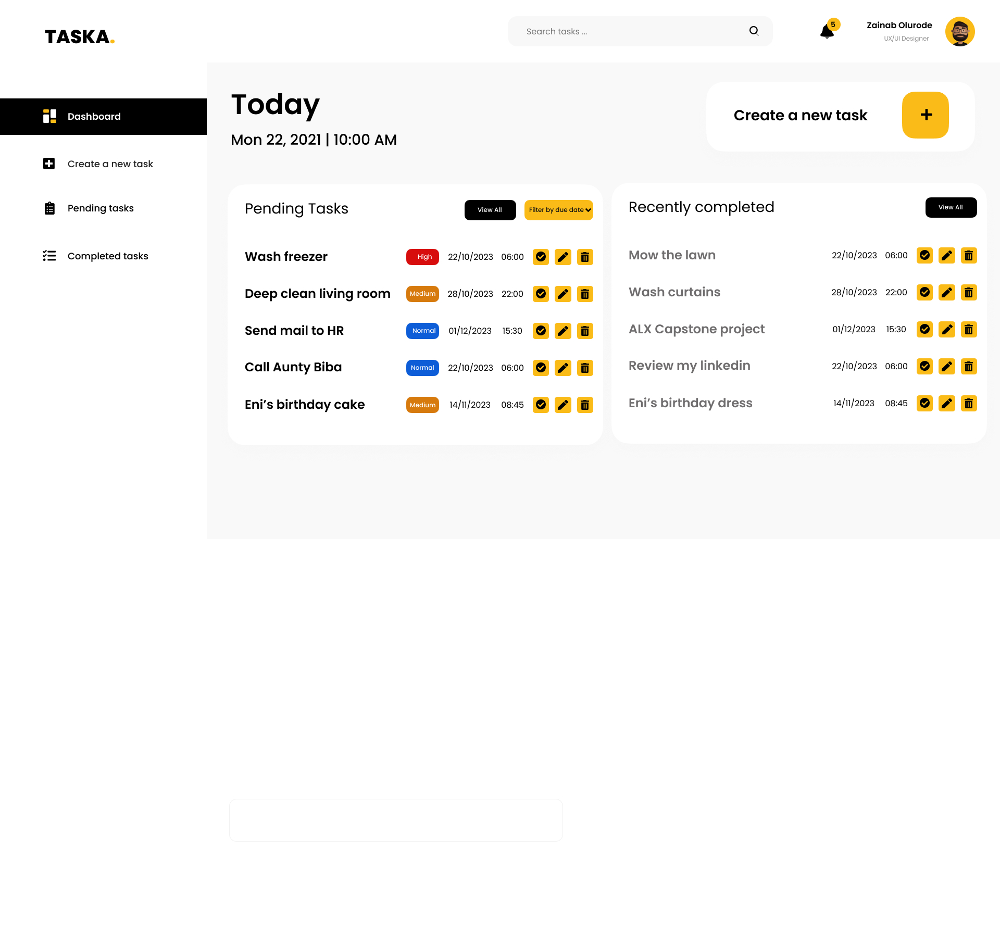
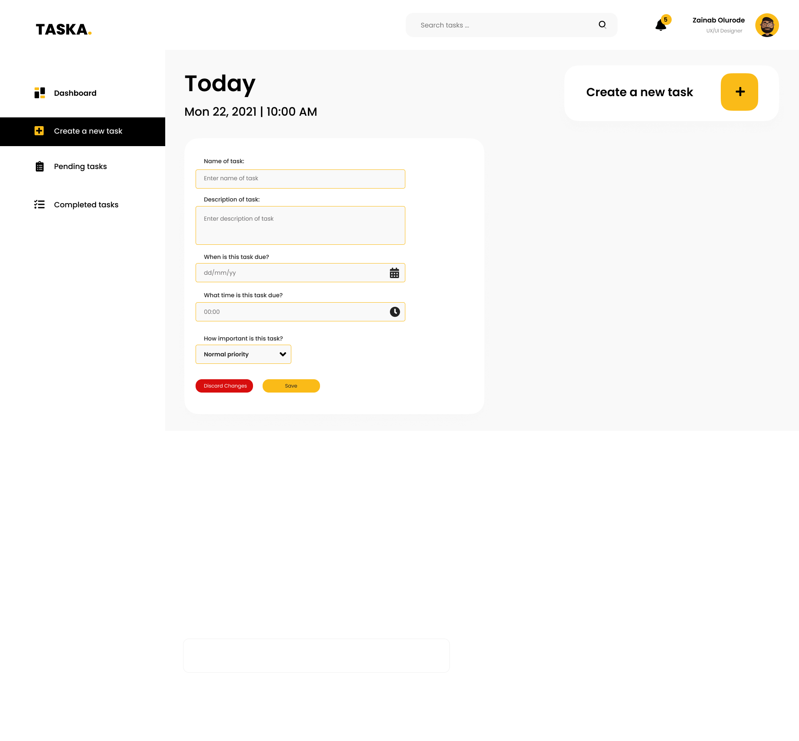
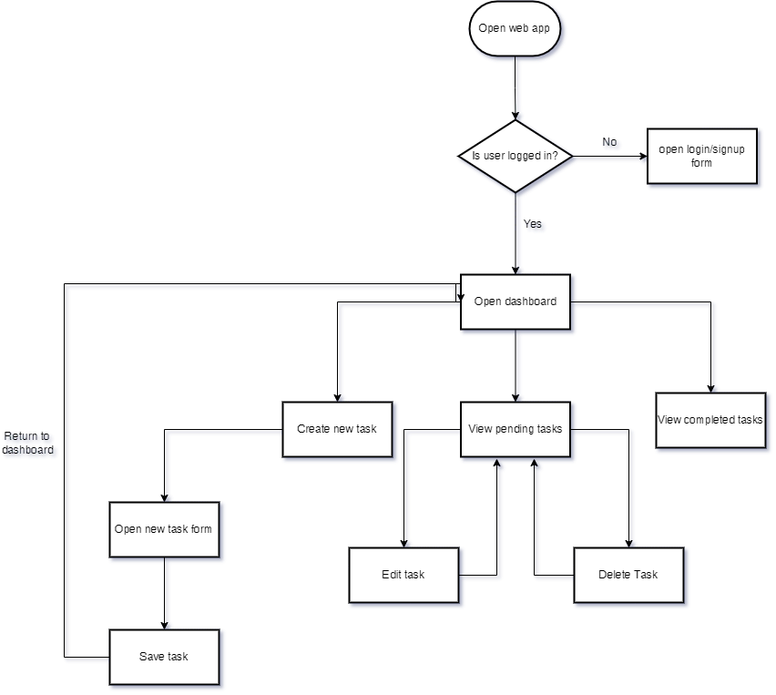

# Intro to Software Engineering - Capstone Project

> Web Stack - Fullstack

# Project Overview

This is a portfolio project overview for the ALX capstone project.
The main objectives are:

- An overview about myself
- My projects and a description of the functionality of the projects
- The skills that I have accrued throughout my time as a developer
- Contact information

## Description:bulb:

- Advanced HTML/CSS
- CSS
- Flask
- Advanced Javascript
- Nodejs
- Python

## Technologies & Tools:computer:

---

## Features & Functionality

- [About](#about)
- [Projects](#projects)
- [Skills](#skills)
- [Contact](#contact)

## Project Screenshot

<table>
<tr>
<td valign="top" width="50%">

</td>

<td valign="top" width="50%">

</td>
</tr>
</table>

## Project Workflow & flowchart

The project in development is a task manager web app, which has the following main objectives:

- Design and implement a visually appealing and user-friendly website layout.
- Include sections for an “about me”, skills, projects, and contact information.
- Display your projects with brief descriptions, images, and links to live demos or source code repositories.

<table>
<tr>
<td valign="top" width="50%">

</td>

<td valign="top" width="50%">

</td>
</tr>
</table>

## Design of the prototype

Here is the high fidelity prototype of the portfolio website:

<table>
<tr>
<td valign="top" width="50%">

## Roadmap and future enhancements

- I plan to rewrite this project in Typescript very soon

## Author

- **Zainab Olurode**

## Contact information

[Zainab Olurode-Razaq](https://www.linkedin.com/in/zainab-olurode)
