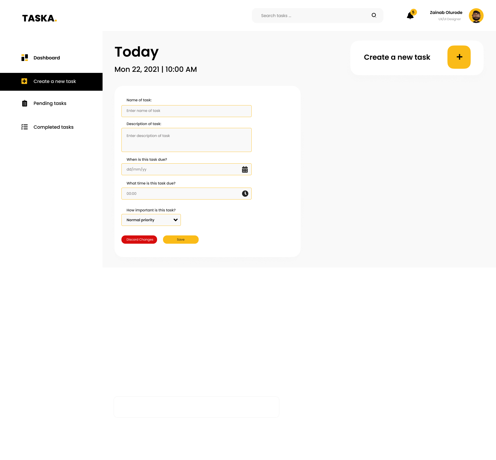

# Intro to Software Engineering - Capstone Project

# TASKA - A Task

> Web Stack - Fullstack

## Description :bulb:

- Advanced HTML/CSS
- CSS
- Advanced Javascript
- Nodej/s
- Git
- Local storage

## Technologies & Tools:computer:

---

## Features & Functionality

- Dashboard
- Add New Task
- Edit Task
- Delete Task

## Project Workflow & flowchart

The project in development is a task manager web app, which has the following main objectives:

- A responsive user interface for creating, editing, and deleting tasks using HTML and CSS.
- Task management functionality, such as adding new tasks, marking tasks as complete, and deleting tasks.
- Implement data storage for tasks using local storage
- Features like task categorization, due dates, and priority levels.
- Search and filtering options to help users find specific tasks.
- Reminder functionality to set reminders or notifications for important tasks.

<table>
<tr>
<td valign="top" width="50%">

</td>

<td valign="top" width="50%">

</td>
</tr>
</table>

## Project Screenshot

Here are some screens from the high fidelity prototype of the Taska web app:

<table>
<tr>
<td valign="top" width="50%">

## Roadmap and Future enhancements

- I plan to rewrite this project in Typescript to include:
  - Functionality to add tasks to Google Calendar
  - Functionality to handle several different user profiles

## Author

- **Zainab Olurode**

## Contact information

[Zainab Olurode-Razaq](https://www.linkedin.com/in/zainab-olurode)
